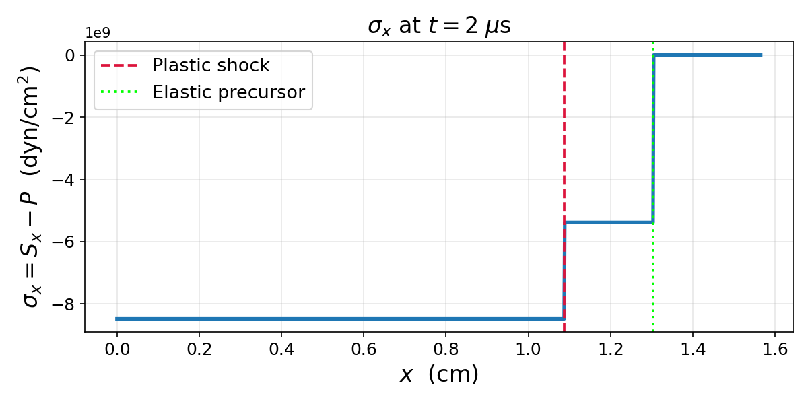
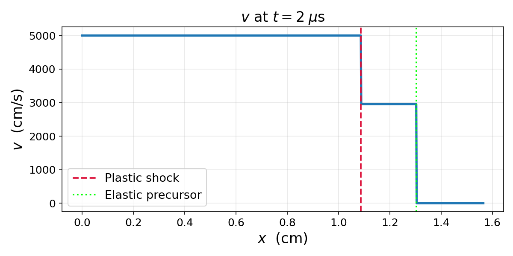

# Elastoplastic Piston Test Problem

The problem is a one dimensional hydrodynamic elastoplastic test
problem. It consists of a 1D medium between $\left[0,L\right]$, starting
at rest i.e velocity 0 and specific internal energy $e=e_{initial}$,
with a piston at $x=0$ moving the in the direction of the positive
$x$-axis with velocity $U_{piston}$. The material is a perfectly
elastic-plastic material i.e. constant shear modulus $G$ and yield
strength $Y_{0}$ it has a Mie-Gruneisen equation of state (see
[Mie-Gruneisen EOS](#mie-gruneisen-eos)).
The piston generates an inelastic
shock wave with velocity $U_{s}$ and an elastic precursor ahead of it
with a velocity $U_{s,e}.$ So we have 3 regions, the cold unaffected
region, the material influenced by the elastic wave and not yet affected
by the shock wave and and the shocked material.

## Example: Aluminum Piston

The following example solves the elastoplastic piston problem for
**Aluminum** (CGS units) with a piston velocity of 5000 cm/s, evaluated
at $t = 2\;\mu s$.

```python
import numpy as np
from elastoplastic_piston_solver import ElastoplasticPistonSolver

# Material parameters (Aluminum, CGS)
solver = ElastoplasticPistonSolver(
    rho_0=2.79,        # g/cm^3    — reference density
    C_0=5.33e5,        # cm/s      — bulk sound speed
    s=1.34,            #           — Hugoniot slope coefficient
    Gamma_0=2.0,       #           — Gruneisen parameter
    G=2.86e11,         # dyn/cm^2  — shear modulus
    Y_0=2.6e9,         # dyn/cm^2  — yield strength
    e_initial=0.0,     # erg/g     — initial specific internal energy
    v_piston=5000.0,   # cm/s      — piston velocity
)

# Evaluate at t = 2 microseconds
t = 2.0e-6  # seconds
x_max = 1.2 * solver.U_se * t
x = np.linspace(0.0, x_max, 1000)

result = solver.solve(t, x)
```

The returned `result` dictionary contains arrays for `"density"`,
`"pressure"`, `"velocity"`, `"energy"`, `"Sx"` (deviatoric stress), and
`"stress"` (total axial stress $\sigma_x = S_x - P$), as well as the
scalar positions `"shock_location"` and `"elastic_precursor_location"`.

### Stress profile



### Velocity profile



The three piecewise-constant regions are clearly visible: the **shocked
region** (behind the plastic shock), the **elastic region** (between the
plastic shock and the elastic precursor), and the **initial undisturbed
region** (ahead of the elastic precursor).

To reproduce these plots, run:

```bash
python examples/example_aluminum_piston.py
```

## Derivation of the Analytic Solution

We start the deviatoric stress, below the yield limit.

$$\frac{dS_{x}}{dt}=\frac{4}{3}G\frac{\partial v}{\partial x}$$

Where

$$S_{x}=S_{xx},\ S_{y}\equiv S_{yy},\ S_{z}\equiv S_{zz}$$

Which when integrated for uni-axial motion gives (since
$\frac{1}{\rho}\frac{d\rho}{dt}=-\frac{\partial v}{\partial x}$)

$$S_{x}=\frac{4}{3}G\ln\frac{\rho_{0}}{\rho}$$

This holds until
$\boldsymbol{S}:\boldsymbol{S}\leq\frac{2}{3}Y_{0}^{2}$ or

$$S_{x}^{2}+S_{y}^{2}+S_{z}^{2}\leq\frac{2}{3}Y_{0}^{2}$$

since there are no shear stresses. Using $S_{z}=S_{y}=-\frac{1}{2}S_{x}$,
since $S_{x}+S_{y}+S_{z}=0$ and symmetry. We get that at and above the yield
point

$$\left(S_{x}^{Y}\right)^{2}+\frac{1}{4}\left(S_{x}^{Y}\right)^{2}+\frac{1}{4}\left(S_{x}^{Y}\right)^{2}\leq\frac{2}{3}Y_{0}^{2}$$

Setting $S=S_{x}$

$$\frac{3}{2}\left(S^{Y}\right)^{2}\leq\frac{2}{3}Y_{0}^{2}$$

$$\left(S^{Y}\right)^{2}\leq\frac{4}{9}Y_{0}^{2}$$

$$S^{Y}=-\frac{2}{3}Y_{0}$$

Thus after reaching the yield point

$$S^{Y}=-\frac{2}{3}Y_{0}=\frac{4}{3}G\ln\frac{\rho_{0}}{\rho^{Y}}$$

$$\rho^{Y}=\rho_{0}e^{\frac{Y_{0}}{2G}}$$

The Hugoniot relations (from Wilkins).

$$U_{shock}^{2}=\frac{1}{\rho_{0}}\frac{\sigma_{1}-\sigma_{0}}{\left(1-\frac{\rho_{0}}{\rho_{1}}\right)}=\frac{\rho_{1}\left(\sigma_{1}-\sigma_{0}\right)}{\rho_{0}\left(\rho_{1}-\rho_{0}\right)}$$

where, $\sigma\equiv\sigma_{x}$ and $\sigma=S-P$ since
$\sigma_{0}\approx0$,

$$\sigma_{1}=\sigma^{Y}=-\frac{2}{3}Y_{0}-P^{Y}=-\left(\frac{2}{3}Y_{0}+P^{Y}\right)$$

and $\rho^{Y}$ we get that

$$U_{se}^{2}=\frac{\rho^{Y}\sigma^{Y}}{\rho_{0}(\rho_{0}-\rho^{Y})}=-\frac{\rho^{Y}\left(P^{Y}+\frac{2}{3}Y_{0}\right)}{\rho_{0}(\rho_{0}-\rho^{Y})}$$

The internal energy from the Hugoniot relation

$$e_{1}-e_{0}=-\frac{1}{2}\left(\sigma_{1}+\sigma_{0}\right)\left(1-\frac{\rho_{0}}{\rho_{1}}\right)$$

Or

$$e^{Y}=e_{0}+\frac{1}{2\rho^{Y}\rho_{0}}\left(P^{Y}\left(e^{Y},\rho^{Y}\right)+\frac{2}{3}Y_{0}\right)\left(\rho^{Y}-\rho_{0}\right)$$

This is an implicit equation for $e^{Y}$ since
$P^{Y}\left(e^{Y},\rho^{Y}\right)$ via the Mie-Gruneisen EOS. After
solving the above we can get the particle velocity (from the Hugoniot
relation

$$v^{Y}=\frac{\rho^{Y}-\rho_{0}}{\rho^{Y}}U_{se}$$

To solve for the plastic shock we solve the Hugoniot system

$$P_{2}=P^{Y}+\rho^{Y}\left(U_{s}-v^{Y}\right)\left(v_{2}-v^{Y}\right)$$

$$\rho_{2}=\rho^{Y}\frac{U_{s}-v^{Y}}{U_{s}-v_{2}}$$

$$e_{2}=e^{Y}+\frac{1}{2\rho^{Y}\rho_{2}}\left(P^{Y}+P_{2}+\frac{4}{3}Y_{0}\right)\left(\rho_{2}-\rho^{Y}\right)$$

since $\sigma_{2}=-P_{2}-\frac{2}{3}Y_{0}$ since we are already past the
yield point at this time.

$$v_{2}=v_{piston}$$

## Solver Algorithm

1.  Define problem parameters

    $$\text{EOS} :\rho_{0},C_{0},s,\Gamma_{0}$$

    $$\text{Elastoplastic} :G,Y_{0}$$

    $$\text{Initial Conditions} :e_{initial},v_{piston}$$

2.  Calculate $\rho^{Y}$ via

    $$\rho^{Y}=\rho_{0}e^{\frac{Y_{0}}{2G}}$$

3.  Calculate $e^{Y},p^{Y}$ by finding the root of the function

    $$f_{Y}\left(e^{Y}\right)=e^{Y}-e_{0}-\frac{1}{2\rho^{Y}\rho_{0}}\left(P^{Y}\left(e^{Y},\rho^{Y}\right)+\frac{2}{3}Y_{0}\right)\left(\rho^{Y}-\rho_{0}\right)$$

4.  Calculate $U_{se}$

    $$U_{se}^{2}=-\frac{\rho^{Y}\left(P^{Y}+\frac{2}{3}Y_{0}\right)}{\rho_{0}(\rho_{0}-\rho^{Y})}$$

5.  Calculate $v^{Y}$ via

    $$v^{Y}=\frac{\rho^{Y}-\rho_{0}}{\rho^{Y}}U_{se}$$

6.  Then we find $U_{s}$ by finding the root of the function

    $$f_{S}\left(U_{s}\right)=P_{2}\left(U_{s}\right)-P_{eos}\left(\rho_{2}\left(U_{s}\right),e_{2}\left(U_{s}\right)\right)$$

    using $v_{2}=v_{piston}$ and

    $$P_{2}=P^{Y}+\rho^{Y}\left(U_{s}-v^{Y}\right)\left(v_{2}-v^{Y}\right)$$

    $$\rho_{2}=\rho^{Y}\frac{U_{s}-v^{Y}}{U_{s}-v_{2}}$$

    $$e_{2}=e^{Y}+\frac{1}{2\rho^{Y}\rho_{2}}\left(P^{Y}+P_{2}+\frac{4}{3}Y_{0}\right)\left(\rho_{2}-\rho^{Y}\right)$$

7.  Calculating $P_{2},\rho_{2},e_{2}$ from the relations.

When given a grid $x_{1},x_{2}....$ and a time $t$ we

1.  Calculate the shock position $U_{s}t$

2.  Calculate the elastic precursor position $U_{se}t$

3.  For a physical value $X$ we return

$$
X(x_i) = \left\lbrace \begin{array}{ll}
X_2 & x_i < U_s t \\
X^Y & U_s t \leq x_i \leq U_{se} t \\
X_{\text{initial}} & U_{se} t < x_i
\end{array} \right.
$$

## Mie-Gruneisen EOS

The Mie-Gruneisen equation of state

$$P\left(e,\rho\right)=P_{H}\left(\rho\right)+\Gamma\left(\rho\right)\rho\left(e-e_{H}\left(\rho\right)\right)$$

for compression $\rho\geq\rho_{0}$

$$P_{H}\left(\rho\right)=\frac{\rho_{0}C_{0}^{2}\mu}{\left(1-s\mu\right)^{2}}$$

where

$$\mu=1-\frac{\rho_{0}}{\rho}$$

is the compression and

$$e_{H}\left(\rho\right)=\frac{1}{2}P_{H}\left(\rho\right)\frac{\mu}{\rho_{0}}=\frac{1}{2}C_{0}^{2}\frac{\mu^{2}}{\left(1-s\mu\right)^{2}}$$

and

$$\Gamma\left(\rho\right)=\Gamma_{0}$$

So together

$$P\left(e,\rho\right)=\frac{\rho_{0}C_{0}^{2}\mu}{\left(1-s\mu\right)^{2}}+\Gamma_{0}\rho\left(e-\frac{C_{0}^{2}\mu^{2}}{2\left(1-s\mu\right)^{2}}\right)$$

The EOS parameters are:

| Parameter    | Description                              |
|--------------|------------------------------------------|
| $\rho_{0}$   | Reference density                        |
| $C_{0}$      | Bulk sound speed at reference state      |
| $s$          | Hugoniot slope coefficient               |
| $\Gamma_{0}$ | Gruneisen parameter (assumed constant)   |

## References

- H.S. Udaykumar, L. Tran, D.M. Belk, K.J. Vanden,
  "An Eulerian method for computation of multimaterial impact with ENO
  shock-capturing and sharp interfaces,"
  *Journal of Computational Physics*, vol. 186, pp. 136–177, 2003.
  [doi:10.1016/S0021-9991(03)00027-5](https://doi.org/10.1016/S0021-9991(03)00027-5).